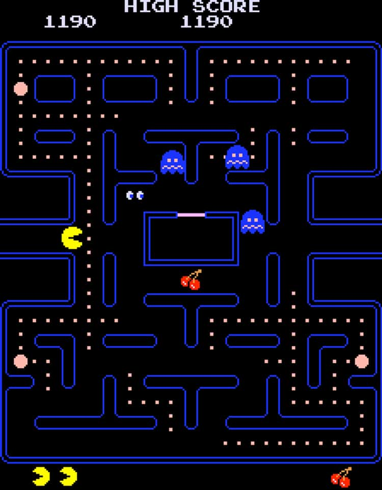

# PacMan Cabinet Hardware Porting on FPGA KR260

This project is a porting of the original PacMan arcade game hardware to FPGA KR260 using the VHDL code from FPGAArcade, created by MikeJ. The goal of this project is to emulate the original hardware of the PacMan arcade game on the KR260 platform.

## Project Structure

The project has the following structure:
- sources: contains the VHDL source files of the design
- project: contains the Tcl script to create the Vivado project
- xdc: contains the constraint file for KR260
- roms: contains the open source Pong game ROM compatible with the PacMan cabinet. To get the original PacMan ROM, you can download it online for MAME
- rom-generator: contains a utility program to convert a MAME ROM to VHDL file compatible with emulating the hardware cartridges of this cabinet

## Project Setup

To create the project, open Vivado and run the command "source design_1.tcl". Once the bitstream is generated, you can load it via USB using Vivado onto the KR260.

For VGA output, you can use a PMOD VGA adapter. We have used [this one](https://digilent.com/shop/pmod-vga-video-graphics-array/) by Digilent. Connect the PMOD VGA to the PMOD 3-4. The command buttons are mapped in the PMOD 1 [5-6-7-8] and the Switch pins are mapped in PMOD 1 [1-2-3-4].

Before loading the bitstream, make sure that pin 2 of PMOD 2 is set to +3.3V to activate VGA in PAL double scanline compatible mode.

To enable the KR260 to upload the bitstream, run the following commands via XSCT:
- connect
- targets -set -nocase -filter {name =~ "\*PSU\*"}
- mwr 0xff5e0200 0x0100
- rst -system

If you want to load a different ROM, you must modify the tcl file (project/design_1.tcl) at line 27 with the new ROM directory. If you change this file, you need to recreate the entire project (remove the project/pacman_kr260 directory and re-launch "source design_1.tcl"). In the "rom-generator" directory, there is a bat script for recompiling the entire PacMan rom, called "build_roms_pacman.bat".

## Contribution

Contributions are welcome. Please feel free to fork the project and create a pull request with any changes or improvements. 

## License

[MakarenaLabs SRL](www.makarenalabs.com)

This project is licensed under the MIT License. See the LICENSE file for more details.

## Original project

 A simulation model of Pacman hardware
 Copyright (c) MikeJ - January 2006

 All rights reserved

 Redistribution and use in source and synthezised forms, with or without
 modification, are permitted provided that the following conditions are met:

 Redistributions of source code must retain the above copyright notice,
 this list of conditions and the following disclaimer.

 Redistributions in synthesized form must reproduce the above copyright
 notice, this list of conditions and the following disclaimer in the
 documentation and/or other materials provided with the distribution.

 Neither the name of the author nor the names of other contributors may
 be used to endorse or promote products derived from this software without
 specific prior written permission.

 THIS CODE IS PROVIDED BY THE COPYRIGHT HOLDERS AND CONTRIBUTORS "AS IS"
 AND ANY EXPRESS OR IMPLIED WARRANTIES, INCLUDING, BUT NOT LIMITED TO,
 THE IMPLIED WARRANTIES OF MERCHANTABILITY AND FITNESS FOR A PARTICULAR
 PURPOSE ARE DISCLAIMED. IN NO EVENT SHALL THE AUTHOR OR CONTRIBUTORS BE
 LIABLE FOR ANY DIRECT, INDIRECT, INCIDENTAL, SPECIAL, EXEMPLARY, OR
 CONSEQUENTIAL DAMAGES (INCLUDING, BUT NOT LIMITED TO, PROCUREMENT OF
 SUBSTITUTE GOODS OR SERVICES; LOSS OF USE, DATA, OR PROFITS; OR BUSINESS
 INTERRUPTION) HOWEVER CAUSED AND ON ANY THEORY OF LIABILITY, WHETHER IN
 CONTRACT, STRICT LIABILITY, OR TORT (INCLUDING NEGLIGENCE OR OTHERWISE)
 ARISING IN ANY WAY OUT OF THE USE OF THIS SOFTWARE, EVEN IF ADVISED OF THE
 POSSIBILITY OF SUCH DAMAGE.

 You are responsible for any legal issues arising from your use of this code.

 The latest version of this file can be found at: www.fpgaarcade.com

 Email pacman@fpgaarcade.com

 Revision list

 version 005 ARTIX7 release - targetting Zedboard / ARTY  modified by J.Hofmann EBV Elektronik  https://www.linkedin.com/in/jho99/
 version 004 spartan3e release
 version 003 Jan 2006 release, general tidy up
 version 002 optional vga scan doubler
 version 001 initial release
